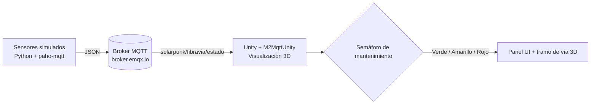

# FibraVia, Gemelo Digital de Pavimento Inteligente con Generación Piezoeléctrica


FibraVia es de los proyectos que más me emocionan: una vía terciaria hecha con asfalto de caucho reciclado (GCR) que además genera electricidad cada vez que pasa un carro, gracias a unos módulos piezoeléctricos. Lo que hice fue un gemelo digital donde simulo la deformación del pavimento, el voltaje que se genera, la carga de las baterías y la temperatura de la mezcla, y todo se ve en Unity con un semáforo de mantenimiento.

> _Aquí voy a poner una captura o GIF del gemelo funcionando (dejaré la imagen en `assets/` y la enlazo)._

## Problema que resuelve

Las vías terciarias en Colombia se dañan rapidísimo, y encima muchas zonas rurales ni siquiera tienen luz. Con este proyecto quise mostrar un gemelo digital de mantenimiento predictivo vial: la idea es detectar la fatiga del pavimento antes de que toque reconstruir toda la vía (que sale carísimo) y, de paso, vigilar la energía que se va generando y guardando.

## Tecnologías

- **Python 3.11+** con `paho-mqtt` para el simulador.
- **MQTT** (broker público `broker.emqx.io`), que mueve todo en **JSON**.
- **Unity** (C#) con **M2MqttUnity** para la parte 3D.

## Arquitectura



## Cómo ejecutar

### 1. Simulador Python

```bash
cd 01_simulador_python
pip install -r requirements.txt
python simulador_fibravia.py
```

### 2. Visualización en Unity

Crea una escena en Unity, agrégale el paquete M2MqttUnity y engancha el script principal a un objeto vacío para conectarte al broker MQTT. El script principal lo tienes en [02_unity_visualizacion/Scripts/VisualizadorFibraVia.cs](02_unity_visualizacion/Scripts/VisualizadorFibraVia.cs).

> **Nota:** en este momento estoy terminando por completo los modelos 3D y la interfaz, así que la escena visual todavía está en proceso. Por ahora comparto el simulador, el script de Unity y el caso de estudio; el proyecto Unity completo lo publicaré cuando lo tenga listo.

## Estructura del proyecto

```
Proyecto_3_FibraVia/
├── 01_simulador_python/
├── 02_unity_visualizacion/
├── 03_documentacion/
└── README.md
```

## KPIs y variables monitoreadas

Estas son las variables que vigilo y lo que hace saltar cada alerta:

| Variable | Rango normal | Alerta |
|---|---|---|
| Deformación | < 2 mm | Amarillo 2-4 mm, rojo > 4 mm |
| Voltaje generado | 20-120 V | Ninguna |
| SoC baterías | 20-100 % | Ninguna |
| Temp. mezcla | 10-35 °C | Ninguna |

## Roadmap

Lo que quiero hacer más adelante:

- [ ] Cambiar el broker público por uno propio (Mosquitto/EMQX self-hosted) con TLS.
- [ ] Guardar las series temporales (InfluxDB) y armar un dashboard en Grafana.
- [ ] Modelar el tramo vial y los módulos piezoeléctricos en low-poly, en vez de primitivas.
- [ ] Sacar un build WebGL para tener la demo en vivo con GitHub Pages.
- [ ] Conectar sensores físicos reales (ESP32) en lugar del simulador.

## Enlaces

- Video demo: *(voy a agregar el enlace de YouTube cuando lo grabe)*
- Caso de estudio: [03_documentacion/caso_de_estudio.md](03_documentacion/caso_de_estudio.md)
- LinkedIn: [Juan David Camelo Zárate](https://www.linkedin.com/in/juan-david-camelo-zarate-75a000421/)

## Autor

Soy Juan David Camelo Zárate, estudiante de Ingeniería Multimedia en la UNAD, apasionado por los gemelos digitales.
